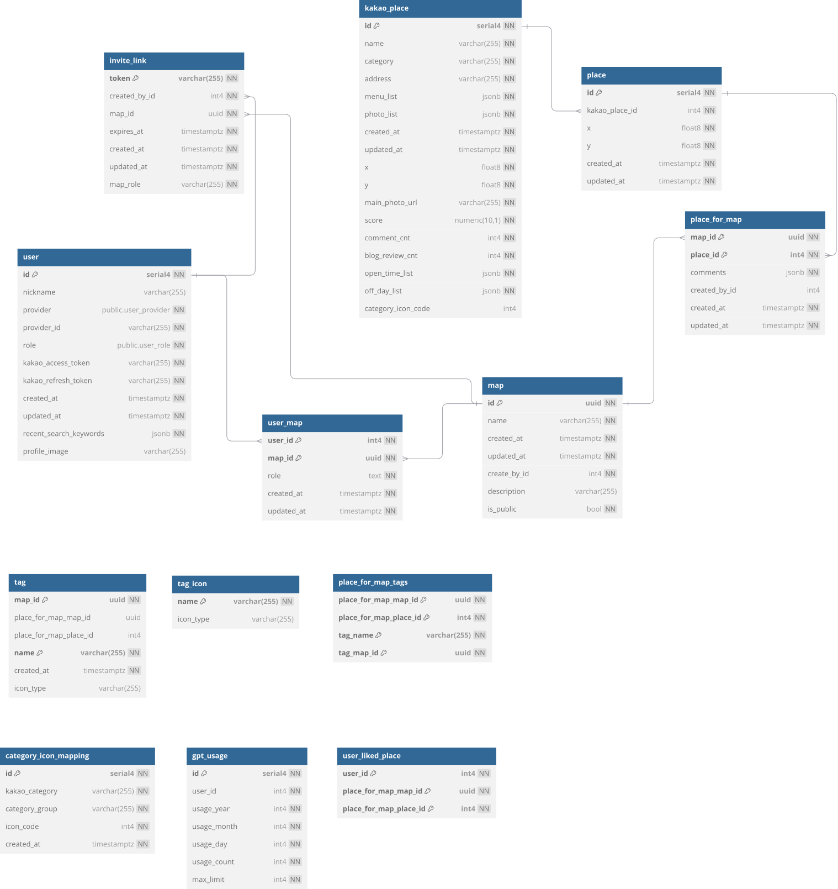

# Korrk (꼬르륵)


## Members

|  |  |  |  |
| :---------------------------------------------------------------------: | :---------------------------------------------------------------------: | :---------------------------------------------------------------------: | :---------------------------------------------------------------------: |
|                    [주병호](https://github.com/Ho-s)                    |                [이찬웅](https://github.com/chanwoonglee)                |                  [정세훈](https://github.com/dearyeon)                  |                 [김바다](https://github.com/sally0226)                  |

## Tech Stack

  
<br/>
  

## ERD



## Before getting started

### 0. Install pnpm

```bash
$ npx pnpm@9.3.0 install
```

### 1. Install deps

```bash
$ pnpm install
```

### 2. Create .development.env

```js
// ./.env
  DB_USER=postgres
  DB_NAME=postgres
  DB_PASSWORD=1q2w3e4r
```

### 2.1. Create local postgres (optional)

```bash
$ docker compose --env-file .development.env up -d
```

### 2.2. Or with migrated local postgres

```bash
$ pnpm postgres:local:up
```

### 3. Migrate database (optional, can skip if you follow step 2.2.)

```bash
$ pnpm migrate:up:dev
```

### 4. Start

```bash
$ pnpm start:dev
```

## Error catch

### [sentry url](https://vitaminc.sentry.io/projects/node-nestjs/?project=4507516570697728)

## GeoQuery with PostgreSQL

To use Geo Queries in PostgreSQL, you need to install the PostGIS extension.

### Using Docker

You can use the official PostGIS-enabled PostgreSQL image, which includes everything pre-installed: [`PostGIS`](https://registry.hub.docker.com/r/postgis/postgis/)

### Installing Locally (Linux/macOS)

#### Ubuntu/Debian (APT Package Manager)

```sh
sudo apt-get install postgis postgresql-16-postgis
```

#### macOS (Homebrew)

```sh
brew install postgis
```

## Todo

PostGIS 설치 필요

Before running postgresql postGIS extension installed needed
